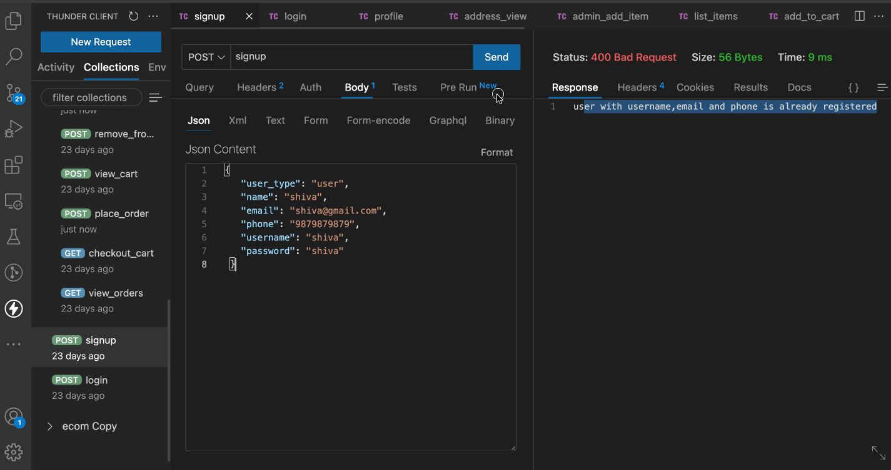

# Ecomerce

```jsx
clone the repo
go mod tidy
go run *.go (or) go build . && ./main
```

```jsx
[GIN-debug] POST   /signup                   --> ecomerce/controller/authenticate.Signup (1 handlers)
[GIN-debug] POST   /login                    --> ecomerce/controller/authenticate.Login (1 handlers)
[GIN-debug] POST   /refresh-token            --> ecomerce/controller/authenticate.RefreshToken (2 handlers)
[GIN-debug] GET    /logout                   --> ecomerce/controller/authenticate.Logout (2 handlers)
[GIN-debug] POST   /deleteme                 --> ecomerce/controller/authenticate.Delete (2 handlers)
[GIN-debug] GET    /profile                  --> ecomerce/controller/user.Profile (2 handlers)
[GIN-debug] GET    /orders                   --> ecomerce/controller/user.ViewOrders (2 handlers)
[GIN-debug] POST   /address/add              --> ecomerce/controller/user.AddAddress (2 handlers)
[GIN-debug] GET    /address/view             --> ecomerce/controller/user.GetAddress (2 handlers)
[GIN-debug] POST   /admin/addproducts        --> ecomerce/controller/ecom.AddProducts (2 handlers)
[GIN-debug] GET    /                         --> ecomerce/controller/ecom.ProductsList (2 handlers)
[GIN-debug] POST   /cart/add                 --> ecomerce/controller/ecom.AddProductToCart (2 handlers)
[GIN-debug] POST   /cart/remove              --> ecomerce/controller/ecom.RemoveProductFromCart (2 handlers)
[GIN-debug] POST   /cart/view                --> ecomerce/controller/ecom.ViewCart (2 handlers)
[GIN-debug] GET    /cart/checkout            --> ecomerce/controller/ecom.CheckoutCart (2 handlers)
[GIN-debug] POST   /cart/placeorder          --> ecomerce/controller/ecom.PlaceOrder (2 handlers)
```

